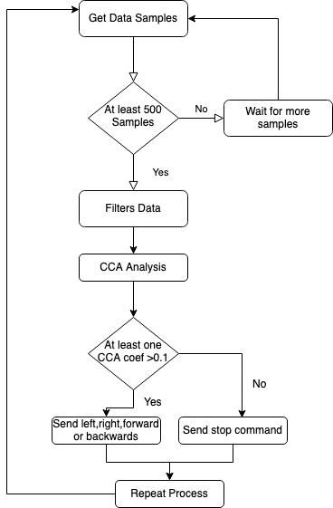

# Capstone Project

# Files
- runner: Meant to be the main controller of the program
- analysis: Does the CCA analysis
- datagen: Generates the data points(random now, will be replaced with openBCI)
- filters: Applys filtering to data set
- transmission: Translates and sends command(wireless)

